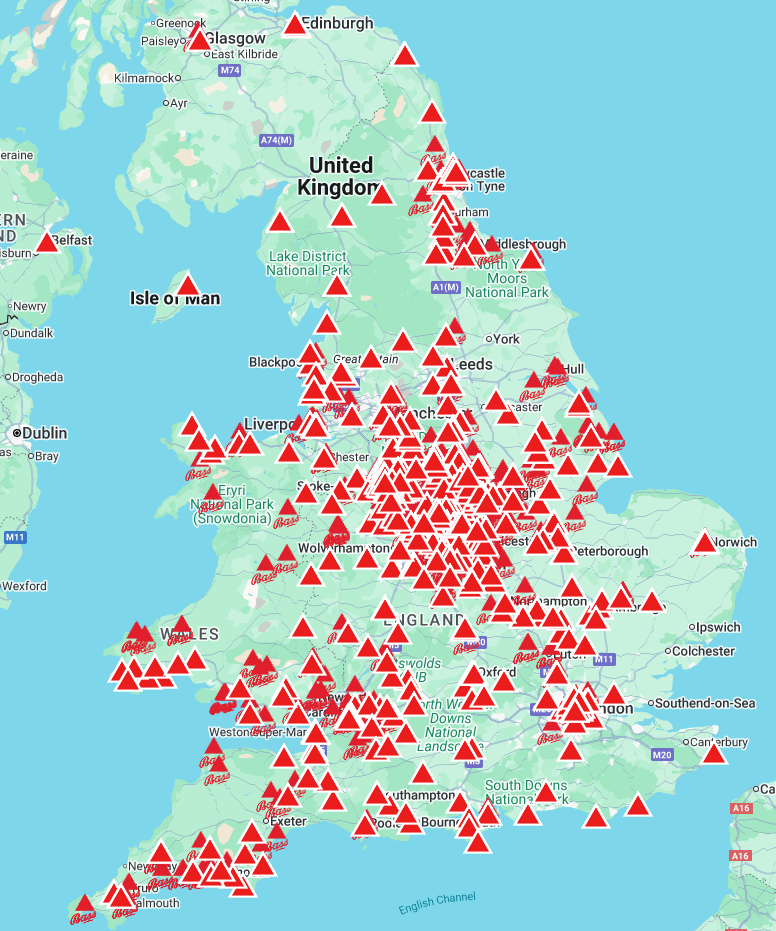

# Bass-map
A small script that reads from the [National Bass Directory](https://nationalbassdirectory.wordpress.com/), uses Google maps' API to find the pubs coordinates and outputs a CSV that can be uploaded to a [personal Google map](https://www.google.com/maps/d/edit?mid=1pgF_A7wvn17yKz4KNUWqZZ62fl7Rfa8&usp=sharing)

## Running

The script is set up to run in Github workflows at 1pm on the first of every month. This should automatically update the `permanent_locations.csv` and `guest_locations.csv` in the root of the repository. However you can also run it locally by following these steps:

1. Make sure you have UV installed, this can be achieved with `pip install uv` if you already have python, or by following the instructions [here](https://docs.astral.sh/uv/getting-started/installation/)
2. Create a google maps places API key [here](https://developers.google.com/maps/documentation/places/web-service/overview). Create a `.env` file in the root of the directory and paste the key in.
3. Run the following command from the terminal: `uv run python main.py`. This should create two `csv` files of the permanent and guest Bass locations.
4. To create a custom layer in Google maps go to [MyMaps](https://www.google.com/maps/d/?hl=en), click create a new map and upload the two csvs

